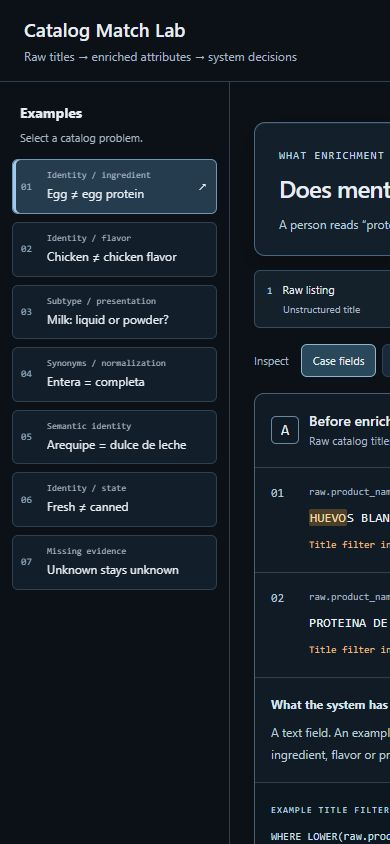

# Catalog Match Lab

A visual lab for **before and after product enrichment**: raw catalog titles become structured attributes that search and comparison code can consume.

Built from problems encountered at [Bakiano](https://bakiano.com). A person can read “proteína de huevo” as a supplement. A catalog system needs separate identity and ingredient fields so an egg search can exclude it reliably. Enrichment also brings differently named products together through normalized subtypes and units.

**[Quick start](#try-it) · [How it works](docs/architecture.md) · [Evaluation](docs/evaluation.md) · [Optional Jev](#try-real-jev-decisions)**



Use **Colors** in the header to try Slate / blue, Graphite / grey or Midnight / blue. The selection is saved locally and does not recalculate matches. Outcome colors retain their meaning. [Palette controls](docs/palettes.md).

## Try it

Node.js 22 or newer. No dependency installation, account, or API key is required.

```sh
git clone https://github.com/alejandrofrank/catalog-match-lab.git
cd catalog-match-lab
npm run dev
```

Open **http://127.0.0.1:4311**.

1. Start with **Egg ≠ egg protein**. The example title filter returns both listings; the structured egg filter returns only the eggs.
2. Switch attribute views to inspect identity, ingredient/flavor and presentation fields. The source titles are retained unchanged.
3. Try **Chicken ≠ chicken flavor**, **Milk: liquid or powder?** and **Fresh ≠ canned** to see the boundaries that separate product identity from flavor or state.
4. Try **Entera = completa** and **Arequipe = dulce de leche**. Normalized subtypes recover a listing missed by the example literal title filter.
5. Open **Unknown stays unknown**. Both listings are search candidates, but absent size prevents an exact presentation match.
6. Expand the record evidence to inspect the input attributes and their source.

The default examples are newly authored illustrative titles and attribute records, **not captured Gemini responses or warehouse exports**. They follow the shape of the enrichment fields and are labeled in the interface. The demo does not enrich a title at runtime or make model calls. Search and comparison consume those supplied attributes; the enrichment stage is separate. [Enrichment versus matching](docs/enrichment.md).

The title filter is a transparent educational predicate, not Bakiano's previous production search engine. A sufficiently specialized name parser could solve individual examples. The lesson is how semantic classification exposes consistent fields for downstream code.

### Rules and CSV sandbox

The earlier editable pair inspector remains at **http://127.0.0.1:4311/rules**. Choose an inventory item, compare it against catalog candidates, edit names, import a CSV or explicitly request Jev decisions. This sandbox uses a small local dictionary; it is kept separate from the default enrichment view.

The comparable-price range includes only accepted identities. The fixture price for a rejected pair stays visible for inspection, but never enters that range. All candidate results and the optional provider are expandable below the primary evidence. The interface uses hover, keyboard-focus and short selection feedback with reduced-motion support.

CSV columns: `sku,product`. There is a [sample file](data/sample.csv). The local demo allows 30 rows and 32 KB. Imports remain in browser memory unless you explicitly use the optional Jev button or download an export.

## What is included?

| Piece | What it does |
| --- | --- |
| Enrichment view | Raw/structured before and after, identity/ingredient/presentation fields, executable offline filters and inspectable records |
| Rules sandbox | Editable pair inspector, normalized attribute checks, CSV import and JSON export |
| Educational keyword baseline | Shows how word overlap can accept a wrong variant |
| Offline identity matcher | A small, explicit Spanish/English vocabulary; checks kind, brand, variant, size, and pack |
| Jev adapter | Optional real structured decisions through a local server |
| Evaluation fixtures | Accepted pairs, conflicting variants and cases that must stay uncertain |
| CI | Offline tests, fixture evaluation and publication checks; no API secrets required |


**This is an educational adaptation, not the complete Bakiano enrichment or search engine.** The default view consumes supplied attribute records. The separate offline title matcher supports only its fixture vocabulary and is not a trained semantic model. No live Jev results are preloaded or represented by the rules column.

All brands, stores, inventory rows and prices in this repository are hand-authored fiction.

## Try real Jev decisions

The adapter follows the [TypeSafe API contract](https://docs.typesafe.ai/api). Your key stays in the Node process; it is never embedded in the page or returned by the server.

Set `JEV_API_KEY` in your terminal environment, then run `npm run dev`. Alternatively, copy `.env.example` to the ignored `.env.local`, add your own key, and start:

```sh
node --env-file=.env.local scripts/serve.js
```

At **/rules**, expand **Optional live Jev comparison**, then click **Run Jev on this item**. This makes one paid provider request with one question per candidate (21 fixture candidates), sends the selected input name to Jev, and shows the provider's actual choice for the inspected pair, model and input-token count. The complete provider answers are retained in the JSON export. No calls run automatically. No monetary price is hardcoded.

The server binds to loopback, rejects foreign origins and unexpected hosts, limits payloads and permits one provider request at a time, up to six per minute. It is a **local development server**, not a production inference gateway. Add authentication, durable usage limits and deployment hardening before hosting it.

Provider failures remain errors. An uncertain response stays uncertain. Reported confidence is not independently measured accuracy.

## Evaluate

```sh
npm test
npm run eval
npm run check:public
```

The fixture evaluation compares 24 deliberately chosen title pairs in the rules sandbox. Separate tests verify the default enrichment view's retrieval and presentation boundaries, including missing size, weak confidence, state and pack differences. These are regression demonstrations, **not a representative market benchmark or proof that one model beats another**. See [evaluation methodology](docs/evaluation.md).

## Where GCP fits

The lab's default catalog is a local fixture. In a real system, a bounded BigQuery query can retrieve candidate products, enriched attributes can support matching, and only approved identities enter the price comparison. The lab does not connect to Bakiano's warehouse.

Pair it with [BigQuery Query Guard](https://github.com/alejandrofrank/bigquery-query-guard) for the query boundary. Jev is an external decision provider, not a Google Cloud service.

## License and contributions

[MIT](LICENSE). See [CONTRIBUTING.md](CONTRIBUTING.md). Please submit synthetic examples rather than customer catalogs, real credentials or private provider responses.
