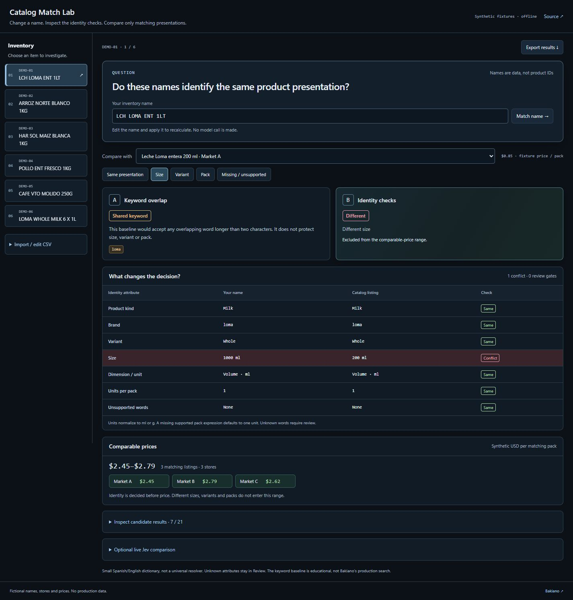
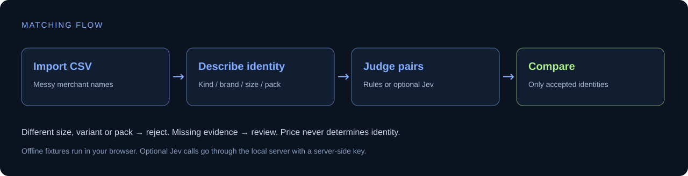

# Catalog Match Lab

A visual, runnable experiment for matching messy inventory names to the **same product presentation** across merchants.

Built from problems encountered at [Bakiano](https://bakiano.com): names differ, abbreviations hide useful attributes, and a cheaper small carton must not be mistaken for a cheaper large one.

**[Quick start](#try-it) · [How it works](docs/architecture.md) · [Evaluation](docs/evaluation.md) · [Optional Jev](#try-real-jev-decisions)**



Use **Colors** in the header to try Slate / blue, Graphite / grey or Midnight / blue. The selection is saved locally and does not recalculate matches. Outcome colors retain their meaning. [Palette controls](docs/palettes.md).

The current [local enrichment UI preview](docs/enrichment-preview.md) has separate desktop, container-comparison and phone screenshots. It is labeled separately from this repository's runnable public demo.

## Try it

Node.js 22 or newer. No dependency installation, account, or API key is required.

```sh
git clone https://github.com/alejandrofrank/catalog-match-lab.git
cd catalog-match-lab
npm run dev
```

Open **http://127.0.0.1:4311**.

1. Choose an inventory item. The default compares a 1 L milk request with a cheaper 200 ml carton.
2. Use **Same presentation**, **Size**, **Variant**, **Pack** or **Missing / unsupported** to inspect a boundary. The controls select real fixture pairs; labels come from the matcher.
3. Compare A's shared keywords with B's identity decision. The attribute table shows normalized values and the exact conflicting or missing checks.
4. Try chicken's **Aliases / units** case: the words do not overlap, but whole chicken and its normalized 1 kg presentation match.
5. Edit the inventory name and click **Match name**. Import a CSV through **Import / edit CSV**, or export the complete results as JSON.

The comparable-price range includes only accepted identities. The fixture price for a rejected pair stays visible for inspection, but never enters that range. All candidate results and the optional provider are expandable below the primary evidence. The interface uses hover, keyboard-focus and short selection feedback with reduced-motion support.

CSV columns: `sku,product`. There is a [sample file](data/sample.csv). The local demo allows 30 rows and 32 KB. Imports remain in browser memory unless you explicitly use the optional Jev button or download an export.

## What is included?

| Piece | What it does |
| --- | --- |
| Visual lab | Editable pair inspector, boundary controls, normalized attribute checks, CSV import and JSON export |
| Educational keyword baseline | Shows how word overlap can accept a wrong variant |
| Offline identity matcher | A small, explicit Spanish/English vocabulary; checks kind, brand, variant, size, and pack |
| Jev adapter | Optional real structured decisions through a local server |
| Evaluation fixtures | Accepted pairs, conflicting variants and cases that must stay uncertain |
| CI | Offline tests, fixture evaluation and publication checks; no API secrets required |



**This is an educational extraction, not the complete Bakiano search engine.** The offline matcher supports the vocabulary in the fixtures. It is not a trained semantic model. The keyword baseline is intentionally simple and is not our former production engine. No live Jev results are preloaded or represented by the rules column.

All brands, stores, inventory rows and prices in this repository are hand-authored fiction.

## Try real Jev decisions

The adapter follows the [TypeSafe API contract](https://docs.typesafe.ai/api). Your key stays in the Node process; it is never embedded in the page or returned by the server.

Set `JEV_API_KEY` in your terminal environment, then run `npm run dev`. Alternatively, copy `.env.example` to the ignored `.env.local`, add your own key, and start:

```sh
node --env-file=.env.local scripts/serve.js
```

Expand **Optional live Jev comparison**, then click **Run Jev on this item**. This makes one paid provider request with one question per candidate (21 fixture candidates), sends the selected input name to Jev, and shows the provider's actual choice for the inspected pair, model and input-token count. The complete provider answers are retained in the JSON export. No calls run automatically. No monetary price is hardcoded.

The server binds to loopback, rejects foreign origins and unexpected hosts, limits payloads and permits one provider request at a time, up to six per minute. It is a **local development server**, not a production inference gateway. Add authentication, durable usage limits and deployment hardening before hosting it.

Provider failures remain errors. An uncertain response stays uncertain. Reported confidence is not independently measured accuracy.

## Evaluate

```sh
npm test
npm run eval
npm run check:public
```

The fixture evaluation compares 24 deliberately chosen pairs. It reports correctness and false accepts for the reference baseline and rules. This is a regression demonstration, **not a representative market benchmark or proof that one model beats another**. See [evaluation methodology](docs/evaluation.md).

## Where GCP fits

The lab's default catalog is a local fixture. In a real system, a bounded BigQuery query can retrieve candidate products, enriched attributes can support matching, and only approved identities enter the price comparison. The lab does not connect to Bakiano's warehouse.

Pair it with [BigQuery Query Guard](https://github.com/alejandrofrank/bigquery-query-guard) for the query boundary. Jev is an external decision provider, not a Google Cloud service.

## License and contributions

[MIT](LICENSE). See [CONTRIBUTING.md](CONTRIBUTING.md). Please submit synthetic examples rather than customer catalogs, real credentials or private provider responses.
