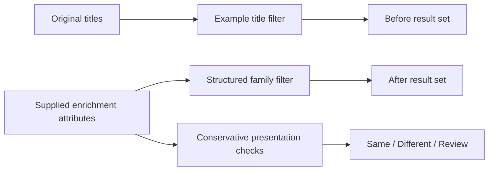
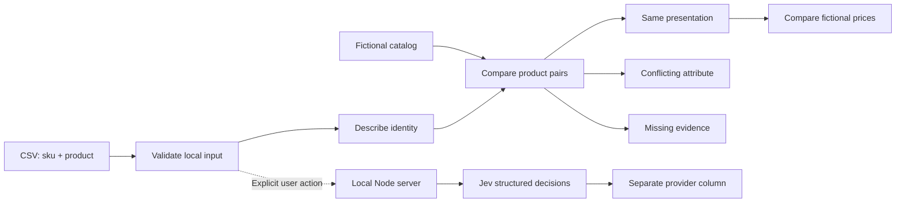

# Architecture

## Default enrichment view

The default route consumes supplied raw/attribute records. It does not run the dictionary or a model to generate the after column.

The bundled examples are explicitly illustrative, not captured model responses. Record values, displayed predicates and result sets share the same data. src/enriched.js consumes attributes without parsing raw names. The view demonstrates how a separate classification stage can supply the fields that downstream code needs; [field meanings and limits](enrichment.md) explain the boundary.

## Rules sandbox at /rules

The UI calls the same pure matching code used by the tests. There are no precomputed match labels in the UI.

Within /rules, the pair inspector shows the qualifying words shared by the deliberately simple keyword baseline beside the rule decision and its effect on the comparable-price range. `compareNames` returns a `checks` array alongside its decision: normalized values, contradictions, required missing attributes, optional attributes and unsupported words. The decision is derived from those same checks, so the evidence table does not reimplement the matcher.

Known contradictions take precedence over missing evidence. Missing or invalid required attributes and unsupported words abstain. Pack count defaults to one when no supported pack expression is present; this is visible in the interface. The rules never use price to resolve identity.

Boundary controls select existing candidates by their computed checks, rather than injecting a canned verdict. Editing an inventory name recalculates its full candidate set after an explicit submit. CSV validation is reused, and applying an edit invalidates provider results. A response from a provider request started before an edit is discarded.

## Identity before price

The rules normalize known aliases and units, then check:

- Product kind: chicken and broth remain separate.
- Brand: two brands do not become the same SKU because their descriptions overlap.
- Variant: whole milk, skimmed milk and flavored milk are distinct.
- Size and dimension: 1 L equals 1000 ml; 250 g is not 250 ml.
- Pack count: six 1 L cartons are not one 1 L carton.

A contradiction yields `no`. Missing required evidence or unsupported descriptive tokens yield `uncertain`. Only a supported pair yields `yes`. A missing brand is permitted for the explicitly supported unbranded chicken and broth fixtures.

This dictionary is intentionally limited. GTIN/EAN validation, supplier identifiers, multilingual taxonomy coverage, arbitrary pack expressions, candidate retrieval and human-reviewed overrides are natural extensions; they are not implemented here.

The matcher does not look at prices. The displayed min/max range includes only accepted identities from the same synthetic snapshot. There is no currency conversion, promotion modeling or stock inference.

## Optional provider path

The browser sends one selected name and at most 32 candidate pairs to `POST /api/jev`. The local server obtains the API key from its environment and makes a bounded request to the fixed TypeSafe endpoint. It does not return the key, save inputs, or silently substitute a rule result if the provider fails.

Untrusted product names are represented as data in a structured request. The instructions ask the model to ignore instructions within those names. This reduces ambiguity but does not prove immunity to prompt injection. Any high-impact downstream action needs independent validation.

The whole fixture pool is evaluated here. A large catalog would first need a recall-oriented retrieval stage and an evaluation of the products that retrieval missed.

## GCP integration boundary

An application can replace `data/catalog.js` with server-provided candidates from a reviewed BigQuery query. Authorize the caller before fetching data, bind parameters, bound the partition range, and keep query/model budgets explicit.

Do not put credentials in browser JavaScript. Private client catalogs require tenant isolation both in storage and in any matching cache.
