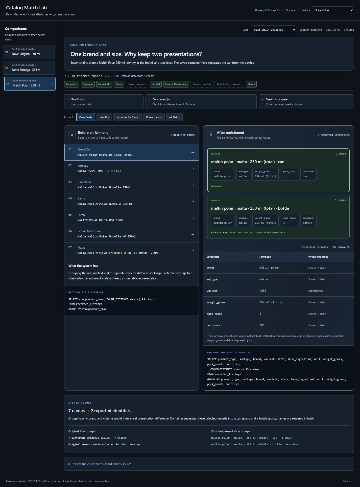
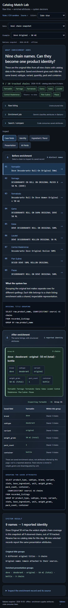

# Local enrichment UI preview

These updated screenshots show the local enrichment comparison with the current Slate / blue palette. **The runnable public demo remains the pair inspector described in the README.** The local enrichment implementation and its recording have not been bundled here; these images document that UI separately.

The displayed original catalog titles and saved classification fields come from the reviewed 2026-10-05 snapshot. This preview does not publish private product IDs, prices, URLs, credentials or customer data. Group agreement reflects reported attributes, not independently verified SKU identity or model accuracy.

## Original chain names → shared reported identity

Nine Dove Original 50 ml titles resolve to one reported presentation while retaining their source names. The screenshot includes the per-chain field inspection and the tracked-chain coverage label.

## A container difference remains visible

The Maltín Polar 250 ml example separates a can from bottles instead of merging them by brand and volume alone.

## Phone layout

Captured on 2026-10-07 with the current UI. Desktop viewport: 1440 × 1100. Phone viewport: 390 × 844. Images contain the rendered UI, not fabricated model output.
